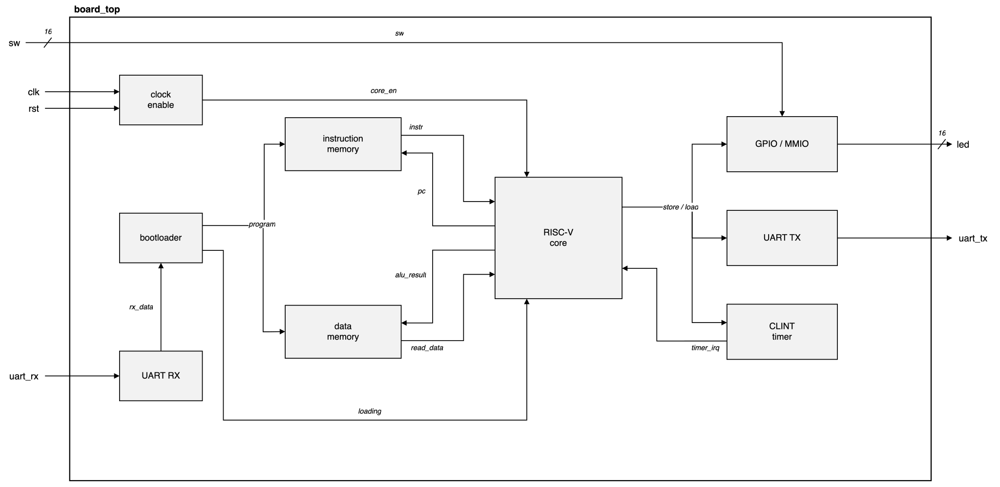
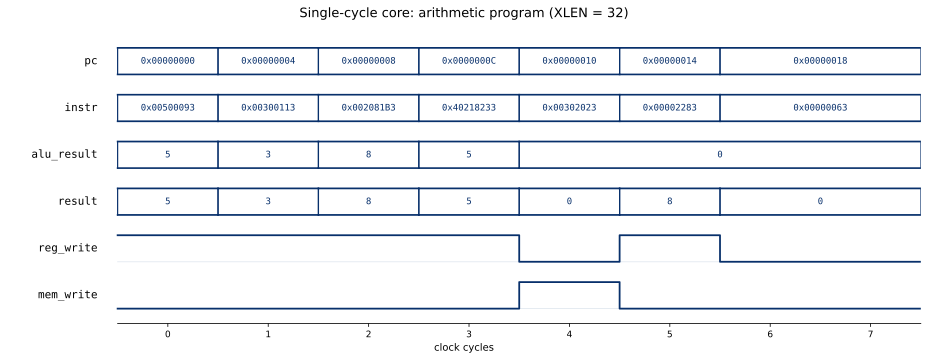
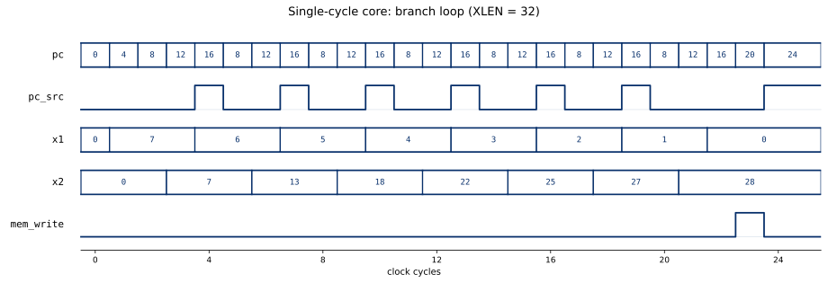
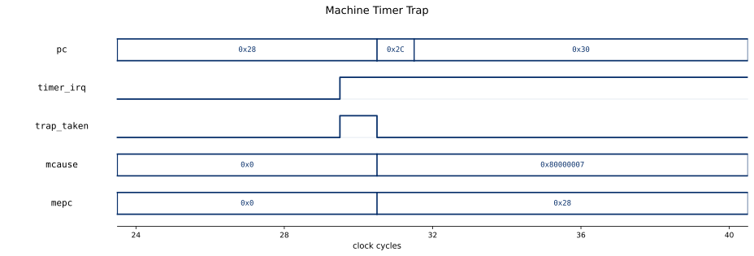

# riscv-single-cycle

[](https://github.com/drewbabel/riscv-single-cycle/actions/workflows/ci.yml)

A single-cycle RV32I processor with machine-mode traps that boots FreeRTOS on a Basys 3, written in SystemVerilog.

The core executes the RV32I base integer instruction set at one instruction per clock, extended with the Zicsr control registers, machine-mode traps, and a core-local timer. The program counter addresses instruction memory, the `control_unit` decodes the fetched word combinationally, the register file supplies operands, the `alu` computes, and the ALU result, a loaded word, a CSR value, or the return address writes back within the cycle. The only sequential state is the `pc` register, the register file, data memory, the CSR file, and the timer.

Data memory is organized as 32-bit words and supports byte, halfword, and word accesses through per-byte write strobes and a load-extend stage. `control_decoder` maps each opcode to the datapath control lines, `alu_decoder` derives the ALU operation from `funct3` and `funct7`, `extend` builds the I, S, B, U, and J immediates, and the `datapath` holds the ALU-operand, write-back, and next-PC multiplexers that the control lines steer.

The `csr` block holds the machine-mode registers and the trap unit. On an exception or an enabled timer interrupt, the trap unit records the faulting program counter in `mepc` and the reason in `mcause`, then redirects the next-PC multiplexer to the `mtvec` handler ahead of any branch or sequential fetch. An `mret` restores the interrupt-enable stack and returns to `mepc`. The `clint` block raises the timer interrupt once its memory-mapped `mtime` reaches `mtimecmp`.

On the Basys 3 the core becomes a small system-on-chip. A serial bootloader streams a program over UART into the instruction and data memories, then releases the core to run the loaded image without re-synthesis, and memory-mapped registers drive the board LEDs and read the switches. On this system the core boots the FreeRTOS kernel and runs a two-task demo scheduled from the `clint` timer tick and context-switched through the trap path and `mret`, where a reader task samples the switches and passes each pattern through a kernel queue to a writer task that drives the LEDs.

The design, testbenches, formal proofs, co-simulation harness, and FreeRTOS port glue were written from scratch. The demo reuses the upstream FreeRTOS-Kernel RISC-V port. A riscv-formal proof under SymbiYosys checks the assembled core against the RISC-V specification, Spike lockstep co-simulation confirms every retired instruction matches a reference simulator, and the FreeRTOS demo validates the full system on real hardware.


## Parameters

| Parameter | Default | Description |
|-----------|---------|-------------|
| `XLEN` | `32` | Data and register width |
| `DEPTH` | `64` | Memory depth in words, raised to `16384` for the Basys 3 system |

## Interface

| Signal | Direction | Width | Description |
|--------|-----------|-------|-------------|
| `clk` | in | 1 | System clock |
| `rst_n` | in | 1 | Synchronous active-low reset |
| `timer_irq` | in | 1 | CLINT machine-timer interrupt |
| `pc` | out | `XLEN` | Program counter of the fetched instruction |
| `alu_result` | out | `XLEN` | ALU output, also the data memory address |
| `write_data` | out | `XLEN` | Store data driven to data memory |
| `mem_write` | out | 1 | Data memory write strobe |

## Instructions

| Format | Instructions |
|--------|--------------|
| Register (`OP`) | `add` `sub` `sll` `slt` `sltu` `xor` `srl` `sra` `or` `and` |
| Immediate (`OP-IMM`) | `addi` `slti` `sltiu` `xori` `ori` `andi` `slli` `srli` `srai` |
| Load (`LOAD`) | `lb` `lbu` `lh` `lhu` `lw` |
| Store (`STORE`) | `sb` `sh` `sw` |
| Branch (`BRANCH`) | `beq` `bne` `blt` `bge` `bltu` `bgeu` |
| Jump | `jal` `jalr` |
| Upper immediate | `lui` `auipc` |
| System | `ecall` `ebreak` `mret` |
| Zicsr | `csrrw` `csrrs` `csrrc` `csrrwi` `csrrsi` `csrrci` |

The `FENCE` instruction is a no-op, and the core runs entirely in machine mode.

## Machine mode

The core traps illegal instructions, `ecall`, `ebreak`, and misaligned instruction, load, and store addresses, and takes the CLINT timer interrupt when `mstatus` and `mie` enable it.

| CSR | Purpose |
|-----|---------|
| `mstatus` | Current and prior interrupt-enable bits |
| `mtvec` | Trap handler base address |
| `mepc` | Faulting program counter |
| `mcause` | Trap cause code |
| `mtval` | Faulting address or value |
| `mie` + `mip` | Interrupt enable and pending |
| `mscratch` | Handler scratch word |
| `mcycle` + `minstret` | 64-bit cycle and retired-instruction counters |

## System-on-chip

`board_top` wraps `riscv_single` for the Digilent Basys 3. Instruction fetch and data access run on separate block RAMs. The core steps once every 32 memory clocks through a clock-enable, so the fast memory serves a fetch and a dependent load within one core cycle. A serial bootloader receives a word count and the program body over UART, writes the words into memory while holding the core in reset, then releases the core at address zero.



| Region | Address | Access |
|--------|---------|--------|
| LEDs | `0x0300_0000` | read + write |
| Switches | `0x0300_0004` | read |
| CLINT `mtime` and `mtimecmp` | `0x0200_xxxx` | read + write |
| UART transmit data | `0x0400_0000` | write |
| UART transmit ready | `0x0400_0004` | read |

A store to the transmit register sends one byte, and polling the ready register before each store lets a program print over the serial line. The transmitter is the formally proven `uart_tx` from the standalone UART project, reused here behind the register interface.

## CoreMark

CoreMark runs on the core as a bare-metal program, timed by the `mcycle` counter and printing its report over the serial transmitter. The port links against the soft-multiply routines in libgcc, since the base integer core carries no hardware multiply.

The core retires one iteration in `718010` cycles, a score of 1.39 CoreMark per MHz measured in simulation. The single-cycle datapath spends the same cycles on every iteration, so the CoreMark per MHz carries to the board, where the raw score scales with the core clock.

## Verification

The riscv-formal proof wraps `riscv_single` in the RISC-V Formal Interface and checks every retired instruction against the RISC-V specification under SymbiYosys, including the machine-mode traps, the Zicsr read and write path, and the misaligned instruction, load, and store cases. Run the proof with `bash formal/rvfi/run.sh`.

Spike lockstep co-simulation runs the core against the Spike reference simulator and compares the register and memory write of every retired instruction, across hand-written programs and a randomized generator that exercises byte, halfword, and word accesses.

The `alu` carries an exhaustive SymbiYosys proof that its `result`, `zero`, `lt`, and `ltu` match an independent reference model over the full input space, and every module has a self-checking testbench, with the `csr`, `clint`, and timer paths driven through directed trap sequences.

The full system runs on a Basys 3, where the FreeRTOS demo drives the trap, timer, and byte-lane memory paths on real hardware. `tb/freertos_boot_tb.sv` reproduces the boot in simulation, and `tb/memcheck_boot_tb.sv` runs a 2000-word store and read-back stress test.

## Results





A timer interrupt fires once `mtime` reaches `mtimecmp`, redirecting the core to the `mtvec` handler and returning through `mret`.



## Building and running

Every module builds from the top-level Makefile.

```
make MOD=alu                                # run a module's testbench
make wave MOD=alu                           # run the testbench and open the waveform in Surfer
make formal MOD=alu                         # run the module's SymbiYosys proof
bash formal/rvfi/run.sh                     # run the full riscv-formal proof of the core
make hex PROG=program                       # assemble tests/program.s to a hex image
make cosim PROG=cosim1                      # lockstep-compare a program against Spike
python3 tests/send_prog.py PORT prog.hex    # stream a program to the board over UART
python3 tests/monitor.py PORT               # print the board's serial output
make -C sw/coremark all                     # build the CoreMark image
./synth_stats.sh riscv_single               # report a module's synthesis cost
```

## Synthesis

Synthesized for the Digilent Basys 3 (Xilinx Artix-7). sv2v first converts the SystemVerilog to Verilog-2005, since Yosys cannot parse the package-scoped port types.

| Module | LUTs | Flip-flops | Carry cells |
|--------|------|------------|-------------|
| `pc` | 0 | 32 | 0 |
| `alu_decoder` | 5 | 0 | 0 |
| `control_unit` | 24 | 0 | 0 |
| `control_decoder` | 30 | 0 | 0 |
| `extend` | 31 | 0 | 0 |
| `clint` | 219 | 128 | 22 |
| `alu` | 497 | 0 | 22 |
| `csr` | 845 | 383 | 32 |
| `regfile` | 911 | 992 | 0 |
| `riscv_single` | 2805 | 1416 | 70 |

The `board_top` system adds the instruction and data memories as 32 block RAMs, 42% of the Artix-7 device.

### Tool versions

Icarus Verilog 13.0, Yosys 0.66, SymbiYosys 0.66 with Yices 2, sv2v 0.0.13, the RISC-V GNU toolchain (`riscv64-elf-gcc` 16.1.0), Spike 1.1.1, Python 3.11, and Surfer.
